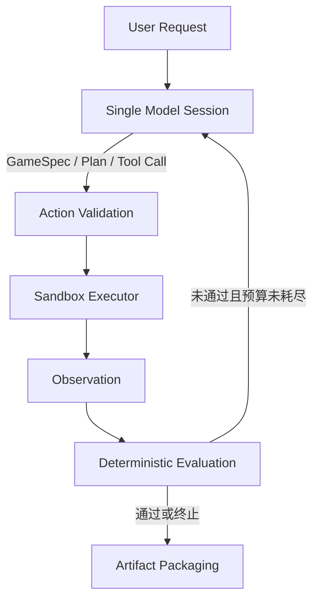
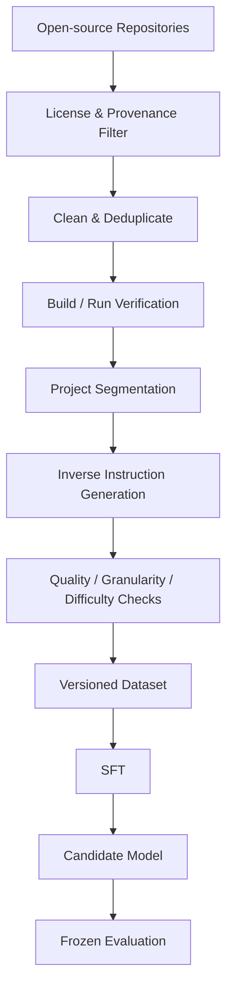

# Architecture

## 1. 架构目标与边界

本项目包含两个独立但可衔接的系统：

1. **Online Agent Runtime**：响应真实用户请求，生成、执行、测试和修复原型。
2. **Offline Research & Training Pipeline**：从开源代码构建训练数据、执行 SFT 并评估模型。

在线请求不得触发 GitHub 批量收集、数据集重建或模型训练。训练后的模型只是 Online Agent 可选择接入的 Model Backend。

## 2. MVP 在线流程



### 有意合并的抽象

- Requirement Understanding、GameSpec、技术方案、任务拆解和修复决策先由**同一个模型会话**完成，不拆成多个 Agent。
- 若模型 API 已原生提供结构化 Tool Calling，则不单独实现通用 Parser；只保留确定性的 Schema Validation。
- Observation 只是 Executor/Evaluator 的结构化结果，不建立独立“观察 Agent”。
- 第一版不要求复杂工作流框架；一个显式循环和状态对象足够。

## 3. MVP 模块契约

| 模块 | 负责什么 | 输入 | 输出 | 上游 | 下游 | LLM / Runtime |
|---|---|---|---|---|---|---|
| Request Interface | 接收请求与运行配置；MVP 可先用 CLI | 用户文本、预算、项目目录 | `RunRequest` | 用户 | Model Session | Runtime |
| Single Model Session | 理解需求、形成 GameSpec/计划、选择下一 Action、根据反馈修复 | 请求、当前状态、Observation | 结构化 GameSpec/计划更新或 Tool Call | Interface / Evaluator | Validator | LLM |
| Run State | 保存本次运行的规格、动作历史、预算和状态；不跨项目长期记忆 | 事件与结果 | 当前 `RunState` | 全流程 | 全流程 | Runtime |
| Action Validator | 校验 Tool Call 的 schema、路径、命令策略和参数 | Tool Call | 已验证 Action 或明确拒绝 | Model | Executor / Model | Runtime |
| Sandbox Executor | 在隔离工作区执行文件操作和允许的命令 | Validated Action | stdout、stderr、exit code、文件变化、超时 | Validator | Observation/Evaluator | Runtime |
| Observation Builder | 将执行结果压缩为稳定、可诊断的结构 | 原始执行结果 | `Observation` | Executor | Model/Evaluator | Runtime |
| Deterministic Evaluator | 执行构建、启动和功能检查，汇总通过/失败 | 项目目录、GameSpec、测试定义 | `EvaluationReport` | Executor | Model / Termination | Runtime |
| Termination Policy | 根据成功条件、最大轮次、时间和成本预算决定继续或结束 | RunState、EvaluationReport | continue / success / stopped | Evaluator | Model / Packager | Runtime |
| Artifact Packager | 汇总源码、依赖、运行说明、功能、测试和限制 | 最终工作区与报告 | 交付目录/清单 | Termination | 用户 | Runtime |

### LLM 与 Runtime 的责任线

**LLM 可以决定：**

- 如何解释模糊玩法；
- GameSpec 和开发计划；
- 创建或修改哪些项目文件；
- 下一步使用哪个允许的工具；
- 如何根据错误提出修复。

**Runtime 必须决定：**

- Tool Call 是否合法；
- 文件路径是否越界；
- 命令是否允许、是否超时；
- 构建和测试的真实结果；
- 预算是否耗尽；
- 哪些文件进入最终交付物。

LLM 不得自行宣告测试通过；成功必须来自 Evaluator 的证据。

## 4. MVP 最小状态模型

```text
RunRequest
  - user_request
  - workspace
  - limits

RunState
  - game_spec
  - plan
  - iteration
  - actions
  - latest_observation
  - latest_evaluation
  - token/time/tool budgets
  - status
```

具体字段为 `TBD`，在实现前通过一到三个 Benchmark Task 验证，不提前设计庞大领域模型。

## 5. 第一版不需要的模块

| 模块 | MVP 决定 | 原因 | 何时重新考虑 |
|---|---|---|---|
| Long-term Memory | 不加入 | 单次项目状态足够；跨项目记忆无已证需求 | 明确出现跨会话复用需求 |
| Vector Database / RAG | 不加入 | MVP 验证生成—执行—修复闭环，不依赖外部检索 | 对照实验表明代码检索带来收益 |
| Multi-Agent | 不加入 | 增加协调、成本和故障面 | 单模型在明确子任务上稳定失败 |
| 独立 Planner Agent | 不加入 | 同一模型会话可先输出计划再行动 | 计划质量成为已测瓶颈 |
| Reflection Agent | 不加入 | 测试反馈后的下一轮修复已构成最小反思 | 普通修复循环无法利用反馈 |
| MCP | 不加入 | 本地文件和命令工具可直接实现 | 需要跨进程/远程标准化工具生态 |
| 复杂 Workflow Framework | 不加入 | 显式状态循环更易调试 | 分支、恢复、并行需求显著增加 |
| 在线 GitHub 搜索 | 不加入 | 与离线数据边界冲突且有许可风险 | 未来定义只读、许可明确的检索产品功能 |

## 6. 离线 Pipeline



离线 Pipeline 各阶段必须保存 provenance、license、仓库版本、处理版本和评测结果。原始仓库、派生样本和 Benchmark 必须按 repository family 隔离，避免 fork、模板和近重复泄漏。

## 7. Online / Offline 接口

二者只有两个允许的显式接口：

1. **Model Interface**：Online Agent 可在相同提示与工具契约下切换基础模型和 SFT 模型。
2. **Evaluation Interface**：模型与 Agent 使用冻结的 Benchmark 任务和相同 Runtime 比较。

第一版不让 Online Agent 直接读取训练数据集，避免评测污染和边界模糊。

## 8. Repository 结构建议

当前只创建文档。代码阶段建议逐步演化为：

```text
.
├── README.md
├── AGENTS.md
├── ARCHITECTURE.md
├── TASKS.md
├── DECISIONS.md
├── docs/
│   ├── product_spec.md
│   ├── evaluation_spec.md
│   └── data_spec.md
├── src/                  # M1 才创建
│   ├── agent/            # 单模型循环和运行状态
│   ├── runtime/          # validation、executor、observation
│   └── evaluation/       # build/functional checks
├── tests/                # 与 src 同步创建
│   ├── unit/
│   ├── integration/
│   └── fixtures/
├── benchmarks/           # M0/M1 创建，小型冻结任务
├── examples/             # 通过验证的示例输入/输出
└── data_pipeline/        # M4 数据试点时才创建
```

不提前创建空的代码包、服务层、数据库层或插件系统。
