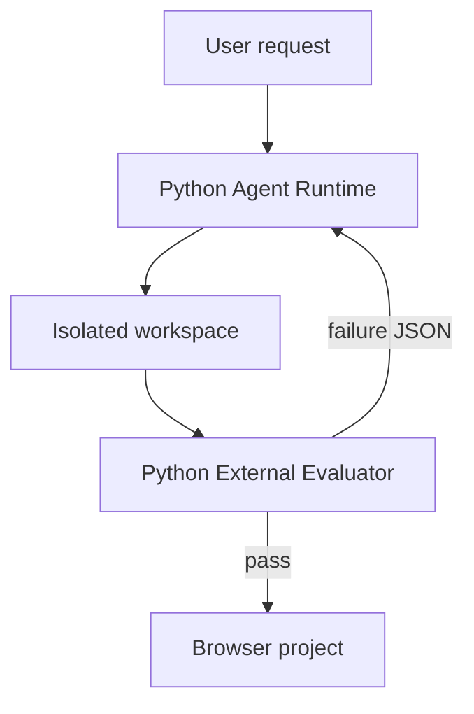
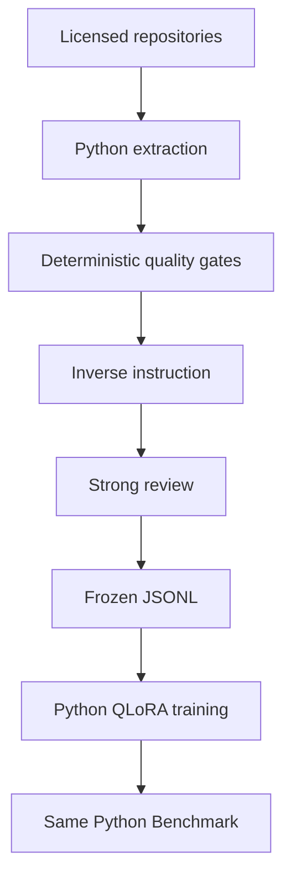

# Architecture

## 1. 边界

项目分为在线 Agent、外部评测、离线数据/训练三套流程。三者共享任务格式和评测标准，但在线请求不会触发 GitHub 抓取或重新训练。

浏览器项目由 HTML/CSS/JavaScript 组成，这是 Agent 的输出，不是 Agent 的实现语言。Python 负责启动 Node、HTTP server 和 Chromium 并判断结果。

## 2. Online Agent

| 模块 | 输入 | 输出 | 责任边界 |
|---|---|---|---|
| `openai_adapter.py` | request、历史 Observation | Tool Calls 或 final | LLM 决策；Key 只从环境读取 |
| `models.py` | 未验证 JSON | Pydantic 模型 | 确定性 schema 与参数约束 |
| `agent.py` | Model、Executor、预算 | 事件轨迹与状态 | 最多 6 轮；单轮最多 8 calls；顺序执行 |
| `runtime.py` | Tool Call | Tool Result | 工作区路径、命令 allowlist、timeout、stdout/stderr/exit code |
| `repair.py` | Agent 结果、评测 JSON | 下一次尝试或结束 | 最多 1 次 evaluator-guided repair |
| `local_models.py` | 相同 Model contract | Qwen artifact actions | Base/SFT 共用 Agent Runtime |

MVP 没有 Planner、RAG、Memory、MCP 或 Multi-Agent。任务分解仍是模型一次推理的一部分。

## 3. Evaluator

Evaluator 代码位于 Agent workspace 外。Agent 只能看到任务文本和失败后的结构化结果，不能读取或修改 evaluator。

- 单文件：Python 启动 Node，隐藏脚本检查导出接口和行为；
- 浏览器项目：检查普通文件、build artifact、状态逻辑和 DOM 合约；
- Launch：Python 以最小权限启动生成的 `project.mjs`，只允许写当前 workspace 的 `dist/`；
- Visual：Python Playwright 检查非白屏、关键控件、viewport 溢出和至少一次交互后的 UI 变化。

Node 与 Chromium 是被测浏览器代码的执行器，不管理 Agent 状态、模型调用或数据 Pipeline。

## 4. Benchmark

`evals/agent_benchmark_v1/` 是历史 TypeScript Runtime 的冻结证据，保持不变。Python 迁移改变了 Runtime commit 和部分目标文件扩展名，因此创建 `agent-benchmark-v2-python-first`：30 个任务，固定预算、模型设置、task catalog 和 evaluator source hashes。旧结果不能直接当作 v2 结果。

## 5. Offline data and training

仓库筛选、family/duplicate 检查、代码单元抽取、instruction 生成/review、freeze 和训练入口均为 Python。抽取目标仍可为 `.ts`，因为 Browser+TypeScript 开源代码是研究数据；这不要求 Agent Runtime 使用 TypeScript。

## 6. Web 产品边界

未来 Web UI 需要少量浏览器 JavaScript 来处理 Chat、Files、Progress、Preview 和 ZIP 下载交互。后端应接 Python Agent Runtime（例如 FastAPI/Starlette），不再维护 Node Agent 后端。当前分支未合并 `feature/web-product`，所以本次迁移没有静默引入或重写该分支。
