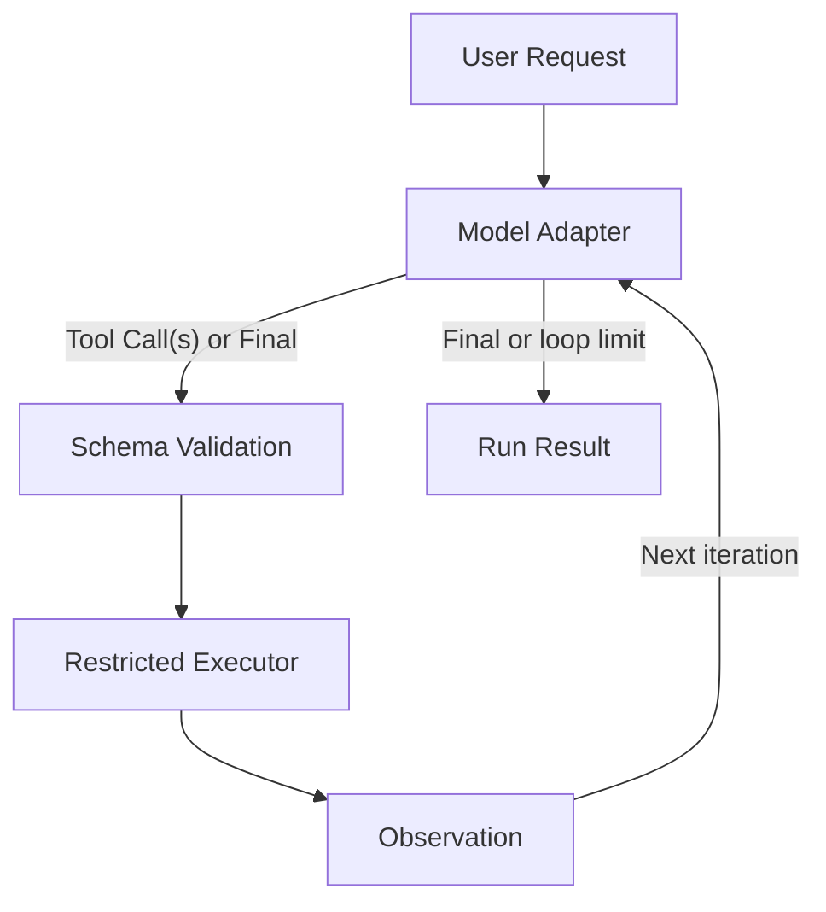
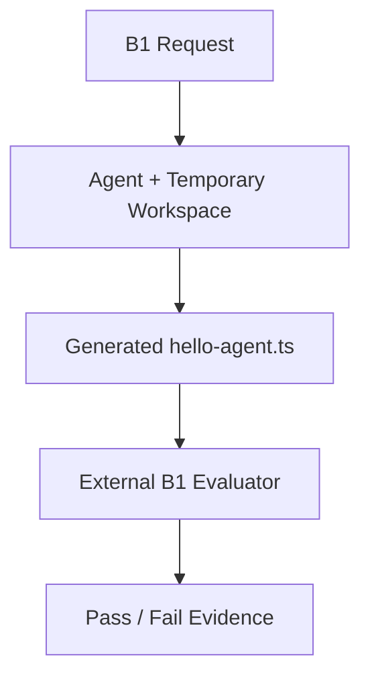
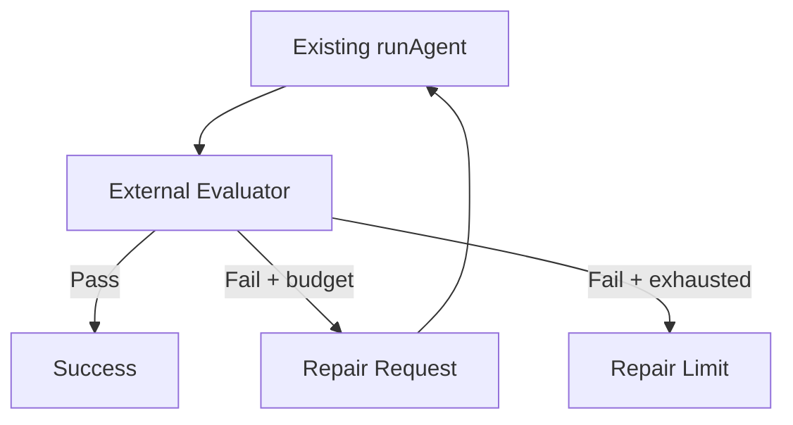
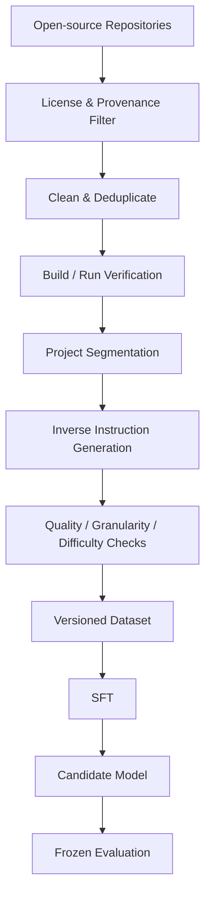

# Architecture

## 1. 架构目标与边界

本项目包含两个独立但可衔接的系统：

1. **Online Agent Runtime**：响应真实用户请求，生成、执行、测试和修复原型。
2. **Offline Research & Training Pipeline**：从开源代码构建训练数据、执行 SFT 并评估模型。

在线请求不得触发 GitHub 批量收集、数据集重建或模型训练。训练后的模型只是 Online Agent 可选择接入的 Model Backend。

## 2. MVP 在线流程



### 有意合并的抽象

- Requirement Understanding、GameSpec、技术方案、任务拆解和修复决策先由**同一个模型会话**完成，不拆成多个 Agent。
- 若模型 API 已原生提供结构化 Tool Calling，则不单独实现通用 Parser；只保留确定性的 Schema Validation。
- Observation 只是 Executor/Evaluator 的结构化结果，不建立独立“观察 Agent”。
- 第一版不要求复杂工作流框架；一个显式循环和状态对象足够。

M1 验证了 Fake Model Tool Calling 闭环。M2 在不修改 `AgentModel` 和 Agent Loop 的前提下加入一个 OpenAI Responses API Adapter，以及独立于 Agent 工作目录的 B1 验收器。GameSpec、游戏评测、自动修复策略和产物打包仍属于后续 Milestone。

### M1 实际执行顺序

1. `runAgent` 将用户请求、迭代号和事件历史交给 `AgentModel.next`；
2. Model 返回一个 Tool Call、有序 Tool Call 批次或 Final Response；
3. Runtime 先检查单轮批次数量，再逐个校验工具名、必需字段、额外字段和超时范围；
4. `ToolExecutor` 按返回顺序逐个执行工具，每项分别产生结构化 Observation；某项失败不会被隐藏，也不会跳过同批后续项；
5. Observation 加入事件历史，下一轮 Model 据此继续或结束；
6. 6 次迭代内没有 Final Response 时，以 `max_iterations` 停止。

## 3. MVP 模块契约

| 模块 | 负责什么 | 输入 | 输出 | 上游 | 下游 | LLM / Runtime |
|---|---|---|---|---|---|---|
| Request Interface | 接收请求与运行配置；MVP 可先用 CLI | 用户文本、预算、项目目录 | `RunRequest` | 用户 | Model Session | Runtime |
| Single Model Session | 理解需求、形成 GameSpec/计划、选择下一 Action、根据反馈修复 | 请求、当前状态、Observation | 结构化 GameSpec/计划更新或 Tool Call | Interface / Evaluator | Validator | LLM |
| Run State | 保存本次运行的规格、动作历史、预算和状态；不跨项目长期记忆 | 事件与结果 | 当前 `RunState` | 全流程 | 全流程 | Runtime |
| Action Validator | 校验 Tool Call 的 schema、路径、命令策略和参数 | Tool Call | 已验证 Action 或明确拒绝 | Model | Executor / Model | Runtime |
| Restricted Executor | 在受限工作目录执行文件操作和允许的命令 | Validated Action | stdout、stderr、exit code、文件变化、超时 | Validator | Observation/Evaluator | Runtime |
| Observation Builder | 将执行结果压缩为稳定、可诊断的结构 | 原始执行结果 | `Observation` | Executor | Model/Evaluator | Runtime |
| Deterministic Evaluator | 执行构建、启动和功能检查，汇总通过/失败 | 项目目录、GameSpec、测试定义 | `EvaluationReport` | Executor | Model / Termination | Runtime |
| Termination Policy | 根据成功条件、最大轮次、时间和成本预算决定继续或结束 | RunState、EvaluationReport | continue / success / stopped | Evaluator | Model / Packager | Runtime |
| Artifact Packager | 汇总源码、依赖、运行说明、功能、测试和限制 | 最终工作区与报告 | 交付目录/清单 | Termination | 用户 | Runtime |

### M1 已实现模块

| 模块 | 文件 | 当前责任 |
|---|---|---|
| Agent Loop | `src/agent/agent-loop.ts` | 驱动 Model、记录事件、捕获模型错误、执行 6 轮上限 |
| Model Contract | `src/agent/types.ts` | 定义 Model、Tool、Observation 和 Run Result 的边界类型 |
| Fake Model | `src/agent/fake-model.ts` | 确定性地产生写文件、执行和最终判断三步行为 |
| Tool Validation | `src/runtime/validation.ts` | 在执行前校验三种 Tool Call 的结构和参数 |
| Workspace Guard | `src/runtime/workspace.ts` | 拒绝绝对路径、`..` 越界和符号链接逃逸 |
| Tool Executor | `src/runtime/tool-executor.ts` | 文件读写；无 shell 命令执行；捕获输出、退出码、超时和错误 |
| CLI | `src/cli.ts` | 提供可人工运行的 Fake Model 演示入口 |

### M2 新增模块

| 模块 | 文件 | 当前责任 |
|---|---|---|
| OpenAI Adapter | `src/model/openai-responses-model.ts` | 将现有 ModelContext 转换成 Responses API 请求，将函数调用还原为既有 Tool Call |
| B1 Fixture | `benchmarks/b1/task.json` | 固定任务文本、目标文件和自动验收条件；不复制到 Agent 工作区 |
| B1 Evaluator | `src/evaluation/b1-evaluator.ts` | Agent 结束后独立检查文件并重新执行，模型无法修改验收代码 |
| Real-model CLI | `src/b1-real-model-cli.ts` | 创建临时工作区、运行 Agent、调用外部验收器并输出运行记录 |

`run_command` 仅允许显式白名单中的可执行文件，参数以数组传递且 `shell: false`。Node 子进程自动启用 permission model，并拒绝模型传入权限放宽参数：Agent 执行器只允许读写本次任务目录，B1—B4 行为 evaluator 只允许读取该目录；B4 launch 的唯一例外是可写当前任务的 `dist/`。Executor 在授权和设置 `cwd` 前先把工作目录规范化为 canonical real path，避免 macOS 的 `/var` → `/private/var` 临时目录映射造成合法文件被拒绝。它提供 M2—M4 所需的最小进程隔离，但仍不是容器或生产级恶意代码沙箱。

### B1 外部验收边界



验收器代码和 `benchmarks/b1/task.json` 位于 Repository，Agent 工具只能访问独立临时目录。即使模型声称成功，最终 B1 结果仍只取决于外部检查的文件类型、stdout、stderr 和 exit code。

### M3 B2/B3 Vertical Slice

M3 不增加新的 Agent 层。两个任务都复用 `OpenAIResponsesModel → runAgent → ToolExecutor`，仅在运行前准备不同工作区，并在结束后选择对应的确定性 evaluator。

| Task | Workspace 初始状态 | Agent 目标 | 外部验收 |
|---|---|---|---|
| B2 | 从 Repository fixture 复制含缺陷的 `math.ts` | 读取文件，将 `add(a,b)` 从减法修复为加法，运行检查 | 动态导入 `math.ts`，使用隐藏的正数、负数、零和小数用例验证 `add` |
| B3 | 空临时目录 | 创建 `card-game.ts`，实现初始状态与一次 Strike | 验证两个导出函数、初始状态和 Strike 后 `{ playerHp:20, playerEnergy:2, enemyHp:14 }` |

两个 evaluator 均位于 Repository 而不是 Agent 工作区。模型可以看到自然语言契约，但不能读取或修改 evaluator 的隐藏断言。Evaluator 会独立重新运行生成代码，模型最终文本仍不参与 pass/fail 判定。

### M4 Playable Browser Project

M4 仍复用同一个 Model Adapter、Agent Loop、Tool schema 和 Executor。空临时工作区中的目标产物为：

| 文件 | 责任 |
|---|---|
| `index.html` | 显示 Player HP、Energy、Enemy HP 和 Strike 按钮，并加载构建模块 |
| `src/game.ts` | 可编辑的 TypeScript 源码；导出状态逻辑和 DOM 挂载函数 |
| `project.mjs` | 无第三方依赖的 build/serve 入口 |
| `dist/game.js` | 由 Agent 执行 build 后产生的浏览器模块 |

独立 B4 evaluator 不向 Agent 暴露源码或断言。它检查普通文件和 source/build 一致性，在只读 Node 子进程中验证初始状态、Strike 状态转换及模拟 DOM 点击。Launch 子进程可读取 canonical task workspace，但只可写入已经存在、非 symlink 的 `<workspace>/dist/`，以兼容启动时重新构建产物的项目；它随后通过 HTTP 请求入口页和浏览器模块。Evaluator 结果不会反馈给模型，因此本阶段没有新增 repair loop。

首次 B4 真实运行表明，多文件任务会触发模型在一次响应中返回多个函数调用。Runtime 因此增加 `tool_calls` 批次输出，但没有新增 Agent 模块：默认每轮最多 8 项，合法批次严格串行执行；超限批次整体拒绝并作为一条失败 Observation 返回下一轮模型。6 次 Model iteration 上限保持不变。

### M5 Evaluator-Feedback Repair Loop



`runWithEvaluatorRepair` 是现有 Runtime 外的一层确定性编排，不改变 Model Adapter、Agent Loop 或 Tool Executor。第一次执行使用原始需求；失败后把 evaluator 的结构化结果加入下一次请求，并在同一 workspace 再次调用 `runAgent`。默认 `maxRepairs = 2`，所以最多发生 1 次初始执行和 2 次修复执行；每次内部仍使用既有 iteration 和 Tool Call 限制。

每个 attempt 保存 phase、实际 request、完整 `AgentRunResult` 和 external evaluation。Evaluator 函数仍由宿主 Runtime 持有，不进入 Agent workspace；模型只能收到评测结果，不能读取或修改 evaluator 实现。通过后立即终止，预算耗尽则返回 `repair_limit_reached` 和所有失败轨迹。

### LLM 与 Runtime 的责任线

**LLM 可以决定：**

- 如何解释模糊玩法；
- GameSpec 和开发计划；
- 创建或修改哪些项目文件；
- 下一步使用哪个允许的工具；
- 如何根据错误提出修复。

**Runtime 必须决定：**

- Tool Call 是否合法；
- 文件路径是否越界；
- 命令是否允许、是否超时；
- 构建和测试的真实结果；
- 预算是否耗尽；
- 哪些文件进入最终交付物。

LLM 不得自行宣告测试通过；成功必须来自 Evaluator 的证据。

## 4. MVP 最小状态模型

```text
RunRequest
  - user_request
  - workspace
  - limits

RunState
  - game_spec
  - plan
  - iteration
  - actions
  - latest_observation
  - latest_evaluation
  - token/time/tool budgets
  - status
```

具体字段为 `TBD`，在实现前通过一到三个 Benchmark Task 验证，不提前设计庞大领域模型。

## 5. 第一版不需要的模块

| 模块 | MVP 决定 | 原因 | 何时重新考虑 |
|---|---|---|---|
| Long-term Memory | 不加入 | 单次项目状态足够；跨项目记忆无已证需求 | 明确出现跨会话复用需求 |
| Vector Database / RAG | 不加入 | MVP 验证生成—执行—修复闭环，不依赖外部检索 | 对照实验表明代码检索带来收益 |
| Multi-Agent | 不加入 | 增加协调、成本和故障面 | 单模型在明确子任务上稳定失败 |
| 独立 Planner Agent | 不加入 | 同一模型会话可先输出计划再行动 | 计划质量成为已测瓶颈 |
| Reflection Agent | 不加入 | 测试反馈后的下一轮修复已构成最小反思 | 普通修复循环无法利用反馈 |
| MCP | 不加入 | 本地文件和命令工具可直接实现 | 需要跨进程/远程标准化工具生态 |
| 复杂 Workflow Framework | 不加入 | 显式状态循环更易调试 | 分支、恢复、并行需求显著增加 |
| 在线 GitHub 搜索 | 不加入 | 与离线数据边界冲突且有许可风险 | 未来定义只读、许可明确的检索产品功能 |

## 6. 离线 Pipeline



离线 Pipeline 各阶段必须保存 provenance、license、仓库版本、处理版本和评测结果。原始仓库、派生样本和 Benchmark 必须按 repository family 隔离，避免 fork、模板和近重复泄漏。

## 7. Online / Offline 接口

二者只有两个允许的显式接口：

1. **Model Interface**：Online Agent 可在相同提示与工具契约下切换基础模型和 SFT 模型。
2. **Evaluation Interface**：模型与 Agent 使用冻结的 Benchmark 任务和相同 Runtime 比较。

第一版不让 Online Agent 直接读取训练数据集，避免评测污染和边界模糊。

## 8. Repository 结构建议

当前 M4 的实际结构为：

```text
.
├── README.md
├── AGENTS.md
├── ARCHITECTURE.md
├── TASKS.md
├── DECISIONS.md
├── docs/
│   ├── product_spec.md
│   ├── evaluation_spec.md
│   └── data_spec.md
├── src/
│   ├── agent/            # 循环、模型契约和 Fake Model
│   ├── model/            # OpenAI Responses API Adapter
│   ├── runtime/          # validation、workspace guard、executor
│   ├── repair/           # evaluator-feedback 外层修复编排
│   ├── evaluation/       # B1—B4 外部验收器
│   ├── b1-real-model-cli.ts
│   ├── b2-real-model-cli.ts
│   ├── b3-real-model-cli.ts
│   ├── b4-real-model-cli.ts
│   ├── cli.ts            # 本地演示入口
│   └── index.ts          # 公共导出
├── tests/                # Node test runner 单元和端到端测试
├── benchmarks/
│   ├── b1/               # 单文件创建任务
│   ├── b2/               # 修改任务与含缺陷 seed
│   ├── b3/               # 最小卡牌逻辑任务
│   └── b4/               # 可玩浏览器卡牌项目任务
├── examples/             # 通过验证的示例输入/输出
├── data_pipeline/        # M6 离线试点的 manifests、samples 与 reports
└── training/sft_smoke/   # 隔离的 Python CPU LoRA 技术链路验证
```

不提前创建空的服务层、数据库层或插件系统。当前四个 evaluator 保持显式、任务专用；等出现真实重复模式后再考虑抽象通用 Evaluation/Repair Loop。

M6 离线 Pilot 不修改 `src/agent`、Model Adapter、Tool Executor 或 evaluator-repair loop。第三方 checkout 只存在于临时工作目录；仓库仅保留固定 manifest、获许可代码单元、SFT/rejection JSONL、notices、验证器与报告。`npm run data:pilot:validate` 是这些制品的确定性边界检查。

M6.1 的 Python loader/LoRA 脚本只消费 accepted JSONL，并将 checkpoint 写入 ignored `artifacts/`。它不被 Online Agent 导入，也不改变 Model Adapter 或 Runtime。

M7 将离线侧拆成三个显式批处理阶段：固定范围提取、独立静态复核、确定性过滤/去重；每阶段使用 JSON/JSONL 制品衔接并保留拒绝记录。当前 extraction spec 仍为人工策展，尚未加入 crawler、数据库或任务平台。

为进行公平的小规模对比，`training/local_model_worker.py` 以持久子进程分别加载 Base 或 LoRA adapter；`ScaffoldedLocalCodeModel` 把模型生成的完整 TypeScript 文件映射到现有 read/write/run Tool 协议。两组继续复用 `runAgent`、`ToolExecutor`、external evaluator 和 repair orchestration。这个 adapter 是评测夹具，不替换产品中的 OpenAI Tool Calling Adapter，也不意味着本地 0.5B 模型具备原生工具规划能力。

M8 在 `data_pipeline/scale/` 增加最小、可恢复的批处理链路：候选 manifest → clone/license/install/build checkpoint → repository-family grouping → G1/G2 symbol extraction → code-to-instruction generation → 独立 review → 48 条分层人工抽检 → deterministic quality/duplicate gates → SHA-256 freeze manifest。阶段间只交换版本化 JSONL；失败保留 reason code 和日志摘要，第三方 checkout 与依赖留在临时目录。抽检暴露明显系统性问题后，正式训练集从初筛 334 条收紧到 186 条。

正式规模实验不会修改 Online Agent。`training/sft_scale/` 使用 `Qwen/Qwen3-4B` 的 LoRA/QLoRA adapter；`src/scale-evaluation-cli.ts` 让 Base 与 SFT 依次经过完全相同的 scaffold、Agent loop、三种 Tool、external evaluator、iteration 和 repair budget。训练 checkpoint 与机器可读结果仍写入 ignored `artifacts/`。

## 9. Agent Benchmark v1

`evals/agent_benchmark_v1/` 将原 B1–B4、B4-REPAIR 和已验证的 holdout evaluator 整理为最终 30-task 固定评测。`src/evaluation/agent-benchmark-v1.ts` 保存可执行 task/evaluator 映射，`agent-benchmark-runner.ts` 统一临时 workspace、Agent/repair 调用与指标聚合。任务覆盖单文件生成、带缺陷 seed 的修改、D1–D3 策略游戏逻辑、五个 D4 Browser 项目和三个受控 self-correction 场景。

Evaluator 与隐藏断言只存在于 Repository 进程，不复制进临时 workspace。Agent 只能通过现有三种 Tool 接触 workspace；首次失败后只接收结构化 evaluation，不获得 evaluator 路径或源码。Project evaluator 在受限 HTTP launch 后由 Repository 侧 Playwright 驱动 headless Chromium，检查渲染、HUD/controls、overflow 和一次真实交互；页面脚本仍处于浏览器沙箱。Freeze manifest 绑定 30 个 task IDs、difficulty、family、预算、模型设置和 evaluator/runtime 源码 hash。GPT-5.6、Qwen3-4B Base 与 Qwen3-4B SFT 共用同一 runner 合同；Base/SFT 的 Qwen decoding 必须完全一致。

## 10. Web Product Adapter

`src/web/` 是展示层适配器，不是新的 Agent 架构。`SessionManager` 为每个请求创建临时 workspace，ReportingModel/ReportingExecutor 仅观察既有接口并将安全的生命周期、Tool Call 和 Observation 摘要映射为 SSE。它们不修改 `runAgent`、Tool schema、Model Adapter 或 repair loop。

`web/public/` 使用 Bolt-style Chat + Workbench 布局。文件和下载 API 只枚举生成 workspace 中的常规非隐藏文件；Preview 通过 `/preview/:sessionId/` 加载到不含 `allow-same-origin` 的 sandbox iframe。服务器只在返回的 HTML 中注入一次性 visual bridge，该 bridge 不写入 workspace/ZIP，负责验证 HUD/controls、overflow 和 Strike 后状态并将结构化结果交给外部 evaluator。OpenAI Key 仅由服务器环境读取，API 只返回 Live Mode 是否可用。

MVP 继续使用服务端 `ToolExecutor`，没有引入 WebContainer、Bolt MessageParser、ActionRunner、RAG、Memory、Planner 或 Multi-Agent。这样既保留已验证的权限/评测闭环，也避免为展示层重构 Runtime。
