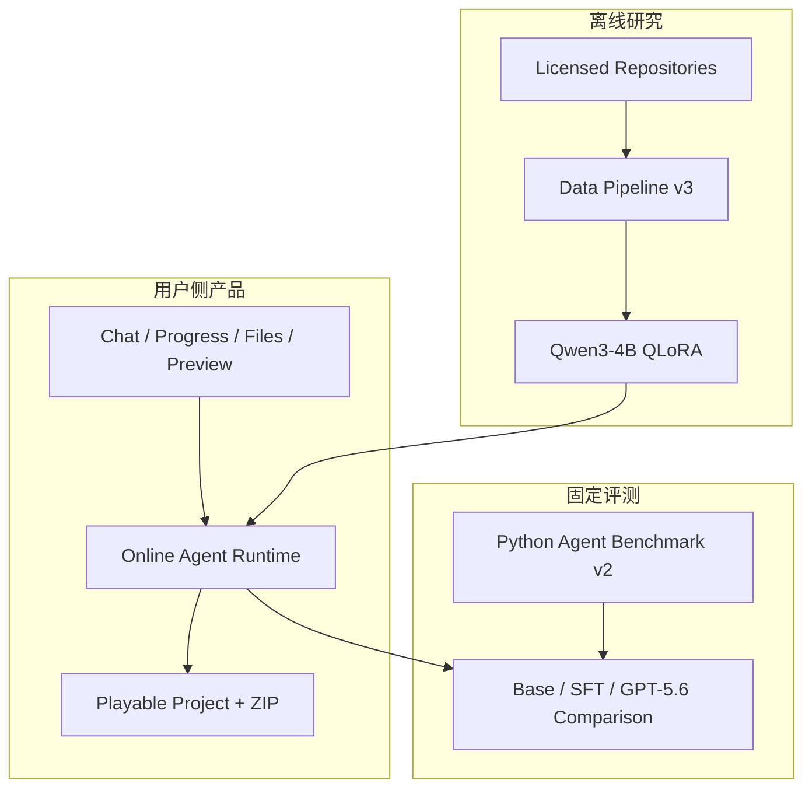

# Strategy Game Prototyping Agent：项目总结与完整蓝图

> 本文同时记录已经完成的工程结果和后续计划。文中的 **Completed** 表示有代码、测试或真实运行记录支持；**In progress** 表示已有实现但结果尚未冻结；**Planned** 描述项目全部完成后的目标形态，不代表已经取得对应数据或指标。

> **2026-09 Python-first 更新：** Agent Runtime、模型 Adapter、Tool Executor、Repair Loop、External Evaluator 编排、数据 Pipeline 和训练代码已统一迁到 Python。浏览器游戏仍由 HTML/CSS/JavaScript 或 TypeScript 表达，因为这是 Agent 的交付格式；Node/Chromium 只负责运行这些交付物。旧 Benchmark v1 和已有运行记录作为历史证据保留，Python Runtime 使用 Benchmark v2 重新建立 baseline。

## 约 300 字总结

这个项目不是让用户一句话生成商业游戏，而是把自然语言玩法变成可运行、可点击、可继续编辑的浏览器策略游戏原型。主体是 Python Coding Agent：模型通过三种受限工具创建项目，Runtime 管理路径、命令和预算，独立 evaluator 负责构建、功能、浏览器交互和修复验收。浏览器中的 HTML/CSS/JavaScript 是交付物，不是 Agent 的实现语言。我们此前用 GPT-5.6 跑通单文件、代码修改、多文件卡牌项目和 repair，并冻结过 30 题 v1 Benchmark；迁移后保留这些历史记录，另建 v2 重新测量。离线侧从许可明确的真实 TypeScript 游戏代码反向生成 instruction，完成过 Pilot、小规模 SFT 和 440 个 code unit 批处理，也暴露过截断、欠规格、行为错配和限流。后续仍需冻结合格数据、比较 Qwen3-4B Base 与 QLoRA SFT，再把 Python 后端接入 Web 工作台。

## 1. 这个项目到底要做什么

### 1.1 产品目标

目标用户是独立开发者、游戏设计师、相关专业学生和 Game Jam 团队。他们通常有玩法想法，但把规则写成第一个可玩的版本仍需要搭目录、写状态逻辑、处理构建错误和反复手测。项目希望缩短的是这段时间，而不是替用户完成商业化制作。

最终用户输入可以类似：

> 做一个轻量卡牌战斗原型。玩家和敌人各有 20 HP，玩家每回合有 3 点能量，Strike 消耗 1 点能量并造成 6 点伤害。

系统应交付：

- 一个结构清楚的多文件 Browser JavaScript/TypeScript 项目；
- 可以复现的安装、构建和启动方式；
- 能在浏览器里实际点击的游戏原型；
- 已实现功能、评测结果和已知限制；
- 不含 API Key、内部 evaluator、临时日志的 ZIP 源码包。

这里的“原型”意味着玩法循环和关键交互可以验证，美术可以使用 CSS、简单图形和占位资源。3D、多人联网、RTS、4X 和商业级素材仍不在第一版范围内。这个取舍主要是为了让代码生成结果可以自动构建和判断，而不是认为这些方向没有价值。

### 1.2 研究目标

项目同时想验证一个更窄的研究问题：如果训练数据不是由模型凭空编题，而是从许可明确、经过检查的真实游戏代码反向生成 instruction，并进一步控制代码粒度、任务类型和难度，那么 SFT 后的代码模型是否更容易在 Agent 中交付可执行的策略游戏代码。

研究结论不能只看 loss，也不能只比较生成文本是否相似。最终判断依据是模型在同一 Agent Runtime、同一工具、同一预算和同一冻结 Benchmark 下，能否更稳定地构建、通过功能测试并在必要时修复。

## 2. 完成后的整体结构

项目不是一个从用户请求开始临时抓 GitHub、再现场训练的长流程。在线产品、离线数据训练和评测是三条分开的链路。



三者只通过两个稳定接口连接：

1. **Model Interface**：Online Agent 可以切换 GPT-5.6、Qwen3-4B Base 或 Qwen3-4B SFT，但 Agent Loop 和工具协议不随模型改变。
2. **Evaluation Interface**：所有模型使用同一套冻结任务、external evaluator、解码参数和运行预算。

训练数据不会被 Online Agent 直接检索，真实用户每次发起请求也不会重新收集 GitHub 数据或训练模型。

## 3. Online Agent：从需求到可玩原型

### 3.1 最小运行闭环

在线部分坚持使用一个显式循环：

```text
User Request
→ Model Adapter
→ Tool Call(s)
→ Schema / Security Validation
→ Restricted Executor
→ Observation
→ Model
→ External Evaluation
→ Repair（如失败且仍有预算）
→ Final Result
```

第一版没有拆 Planner Agent、Coder Agent 或 Reviewer Agent。需求理解、简单计划、文件选择和修复决定都由同一个模型会话完成。这样做不一定是最终最强方案，但在当前规模下更容易看出失败到底来自模型、工具、权限还是 evaluator。

### 3.2 LLM 和 Runtime 的责任边界

| 部分 | 由谁负责 | 当前设计 |
|---|---|---|
| 理解玩法、决定文件和实现方式 | LLM | 通过既有 `AgentModel` 接口，可切换 Model Adapter |
| 选择工具与参数 | LLM | 只允许 `read_file`、`write_file`、`run_command` |
| Tool schema、路径和命令校验 | Runtime | 拒绝越界路径、未知字段、未授权命令和权限放宽参数 |
| 文件与命令执行 | Python Runtime | 临时 workspace、`subprocess` 参数列表、命令白名单和 timeout |
| 判断代码是否成功 | External evaluator | 模型的“完成了”不算证据，必须通过独立测试 |
| 是否继续修复 | Runtime + LLM | Runtime 管预算，LLM 根据结构化失败结果修改代码 |
| 最终打包 | Runtime | 只包含用户项目与必要说明，不包含内部文件 |

默认每次 Agent attempt 最多 6 个 model iterations，每轮最多 8 个按顺序执行的 Tool Calls。当前 repair budget 为 1 次，用于正式 Benchmark；M5 的通用 repair orchestration 支持配置上限并保存每轮 trace。

### 3.3 已经真实跑通的过程

**Completed** 的垂直切片包括：

- B1：创建 TypeScript 文件并输出 `hello agent`；GPT-5.6 用 3 iterations，经 `write_file → run_command` 后通过外部验收。
- B2：读取并修复已有 `math.ts`；Tool Calls 为 `read_file → write_file → run_command`，隐藏用例通过。
- B3：创建最小卡牌状态逻辑；初始 HP/能量和 Strike 后状态通过。
- B4：从空目录生成 `index.html`、`src/game.ts`、`project.mjs` 和构建产物；页面可启动，Strike 点击后 Enemy HP 从 20 变为 14、Energy 从 3 变为 2。
- B4-REPAIR：故意把伤害写成 5，第一次 evaluator 观察到 Enemy HP 为 15；模型收到失败 JSON 后改回 6，第二次 logic、UI 和 launch 均通过。

这些过程也暴露过实际问题。多文件 B4 首次运行时，模型一次返回多个 Tool Calls，旧 Runtime 只允许一个，后来才增加有序批量执行。之后 launch evaluator 又因为 Node permission model 没有 `dist/` 写权限而失败，最终只对当前临时 workspace 的 `dist/` 开放最小写权限。B2/B3 也遇到过 macOS `/var` 与 `/private/var` 的 canonical path 差异。它们不是模型算法问题，但如果不修，端到端成功率仍然是零。

## 4. Evaluation-First：先固定怎么判断，再训练模型

### 4.1 历史 Benchmark v1 与当前 Python Benchmark v2

迁移后的任务目录是 `evals/agent_benchmark_v2/`，由 `strategy_game_agent/benchmark.py` 和 `evaluators.py` 执行。用 `python3 -m strategy_game_agent.cli benchmark` 启动；真实模型和真实浏览器的完整 baseline 尚待运行。以下 v1 数字及 hash 是历史证据，不能用作当前 v2 的完成证明。

**Completed and frozen**：现有 Benchmark 共 30 题，来自早期 B1–B4 基础设施和后续扩展任务。

| 类别 | 任务数 | 主要验收 |
|---|---:|---|
| Code Generation | 4 | 文件存在、编译/执行、精确输出或导出行为 |
| Code Modification | 4 | seed 初始失败、修改后隐藏用例通过 |
| Game Logic | 14 | 卡牌、网格、回合、塔防或资源状态转换 |
| Project-Level Browser Game | 5 | 多文件、build、launch、功能、DOM 和真实浏览器交互 |
| Repair / Self-correction | 3 | 首次受控失败、反馈后修复、repair budget |

难度分布为 D1 10 题、D2 12 题、D3 2 题、D4 6 题。五个项目级任务覆盖 Card Combat、Turn-based Tactics、Tower Defense、Deckbuilder 和 Resource Management。Project-Level evaluator 使用 Playwright 检查页面不是白屏、关键 HUD 和 controls 可见、没有明显 overflow，并至少执行一次真实交互确认 UI 状态变化。

Evaluator 位于 Agent workspace 外，Agent 不能读取或修改。Freeze manifest 绑定 task ID、任务输入、evaluator/runtime hash、6 iterations、8 tools/turn、1 repair、command timeout 和解码设置。当前 manifest SHA-256 为 `653e54ba04312deb12fbbe09b60ada1c3685e9cf82d21b2d9cda337577120528`。后续不能因为某个模型做错题就改验收条件。

### 4.2 正式记录的指标

| 指标 | 含义 |
|---|---|
| Task Success Rate | 最终通过全部必要 evaluator 的任务比例 |
| First-pass Success Rate | 不使用 repair 就通过的比例 |
| Build Pass Rate | 要求构建的任务中，构建成功的比例 |
| Functional Pass Rate | 隐藏行为断言通过的比例 |
| Visual Pass Rate | 项目级任务中浏览器渲染和交互检查通过的比例 |
| Repair Success Rate | 首次失败且进入 repair 的任务中，最终修复成功的比例 |
| Average Repairs Used | 每题平均使用的 repair 次数，同时报告分母 |
| Average Agent Iterations | 每题各 attempt 的平均 model iteration 数 |
| Tool-call Failure Rate | Tool Calls 中被校验拒绝、超时或执行失败的比例 |

正式报告还会按 D1–D4、Card/Tactics/Tower Defense，以及 generation/modification/bug fixing 分组。样本只有 30 题，分组结果主要用于定位失败，不适合包装成统计显著的通用结论。

### 4.3 已有结果和未有结果

- **Completed**：Qwen2.5-Coder-0.5B 的 24 条小规模 SFT，在 6 个 family-isolated holdout 上从 Base 2/6 变为 SFT 3/6；只能说观察到初步正向差异。
- **Completed historically**：GPT-5.6 分别通过过 B1、B2、B3、B4 和 B4-REPAIR，但这些零散结果不能拼成正式 30-task baseline。
- **Planned**：GPT-5.6、Qwen3-4B Base 和 Qwen3-4B SFT 都在完整 Python Agent Benchmark v2 上运行。
- **Not yet available**：正式 Qwen3-4B Base vs SFT 总表、分难度结果和正式 GPT-5.6 baseline。

## 5. Offline Data Pipeline：从真实代码反推训练任务

### 5.1 为什么反向生成 instruction

普通 SFT 往往先写 instruction，再让强模型生成答案。这个项目从已有代码 target `y` 出发，反推出一个能由它回答的开发任务 `q`，最后训练 `(q, y)`。这样可以保留真实代码结构，但也会出现 instruction 说得比代码多、上下文不足或小任务配大段代码的问题，所以“反向生成”本身不是质量保证。

最终的数据链路是：

```text
Repository discovery
→ LICENSE / provenance
→ install / build
→ repository-family grouping
→ code unit extraction
→ D1–D4 target construction
→ inverse instruction generation
→ deterministic quality gates
→ strong reviewer
→ duplicate and family isolation
→ candidate manifest
→ manual confirmation
→ dataset freeze
```

### 5.2 数据范围和许可证

数据集中在 Browser + TypeScript 的 Card/Deckbuilder、Tactics、Tower Defense 和少量 Resource Management。当前只接受根目录具有明确 LICENSE 的 MIT、BSD-2-Clause、BSD-3-Clause 或 Apache-2.0 项目。每条样本保留 repository、commit、license、family、目标文件和 symbol、task type、difficulty、生成元数据和 quality result。

训练集与 Benchmark 必须先按 repository family 隔离，再做 split。Fork、镜像、模板复刻和高相似项目不能跨 train/evaluation。这个策略无法完全排除模型预训练阶段已经见过公开仓库，但至少避免我们自己的 Pipeline 再制造直接泄漏。

### 5.3 数据迭代中实际发生了什么

| 阶段 | 实际结果 | 这一步解决/暴露的问题 |
|---|---|---|
| Data Pilot | 5 个仓库、8 个单元、7 条 accepted | 验证 license、provenance、JSONL 和最小构建链路 |
| Small Expansion | 24 条 accepted | 跑通 assistant-only LoRA 和首次 Base vs SFT |
| Batch Scale-up | 28 个候选仓库中 17 个 build 通过；15 个 family 产出 440 units | 建立批量 clone/build/extract/review/resume |
| 初筛 | 334/440 accepted | 数量达到实验规模，但质量抽检不理想 |
| 收紧旧 gate | 冻结 186 条 | 48 条抽检只接受 14 条，发现截断、欠规格和行为错配 |
| Quality-v2 repair | 438/440 结构通过，只有 1 条适合窄行为执行 | 去掉 instruction 硬截断，补 scope/context 和 fail-closed review |
| Data v3 本地候选 | 275 条生成结果；免费检查后 234 条通过确定性 gate | 41 条被拒；当前 275 条全部是 D1，尚未 strong review、未冻结 |

最近一次 275 条免费检查的拒绝原因为：`UNEXPECTED_SEED` 39 次、`EXPECTED_BEHAVIOR_NOT_IN_INSTRUCTION` 2 次、`SOURCE_LEAKAGE_LANGUAGE` 1 次；其中一条同时触发两个原因。234 条只是进入 strong reviewer 的候选，不是最终训练样本。只有 1 条满足当前极窄的安全行为测试条件并通过，274 条为 `not_eligible`，不能把 repository build 当成 unit-level functional pass。

这批结果还说明现有来源和组合方式没有自然产生 D2–D4。后续 scale-up 的重点不只是继续调用 API，而是增加同文件多 symbol、跨文件系统和项目切片的有效 target；否则数据条数增长了，难度演化仍只是标签。

### 5.4 最终 Data Pipeline v3 的完成标准（Planned）

最终计划冻结约 2.5K–3.5K 条合格样本，但这是目标区间，不是必须凑满 3K。若真实通过率不足，应减少规模或补充合格仓库，而不是降低门槛。

难度必须来自 target 结构：

- D1：一个文件中的单一机制或 symbol；
- D2：同一局部子系统中的多个相关 symbol；
- D3：至少两个文件、多个系统之间存在状态或调用关系；
- D4：至少三个文件，形成可构建或可运行的项目级切片。

任务类型包括 generation、modification、bug fixing、constraint addition、extension 和 refactor。每个不同 code target 只分配一个真实任务类型，不用简单 paraphrase 把一条扩成六条。非 generation 样本必须提供与 target 路径一致、但确实存在缺陷或缺口的 seed files；generation 样本必须没有 seed。

确定性检查先处理 schema、scope、behavior/constraint coverage、required context、granularity、source leakage、license、family、hash 和 exact/near duplicate。只有免费检查通过的样本才交给 strong reviewer 判断 behavior consistency、granularity match 和 missing context。429、incomplete 和网络错误进入 request-failure checkpoint，不被算成质量拒绝，也不会重复请求已经成功的 target。

用户检查 `accepted.jsonl`、`rejected.jsonl`、`summary.json` 和 candidate manifest 后，单独执行 freeze。Freeze 必须满足：accepted 位于目标区间、没有 unresolved API failures、quality-v2 全部 pass、Benchmark family overlap 为零，并生成 dataset SHA-256。训练开始后不再修改这版数据。

## 6. Qwen3-4B 正式 QLoRA（Planned）

### 6.1 为什么选择 Qwen3-4B

Qwen2.5-Coder-0.5B 已用于 CPU smoke test，但容量过小，更多是在验证 loader、masking、LoRA、checkpoint 和评测接口。正式实验选择同一个 `Qwen/Qwen3-4B` 作为 Base 和 SFT 基座，兼顾代码能力与单卡云 GPU 可运行性。SFT 侧只增加 LoRA/QLoRA adapter，不能把不同基础模型的差异算成训练收益。

### 6.2 训练合同

计划使用 4-bit NF4 QLoRA、assistant-response-only loss、固定 seed 和完整冻结训练集。第一轮不做大规模超参搜索，优先保证：

- 数据 hash 和训练配置被保存；
- loss 按 step 记录且为有限值；
- 训练完成后保存 `checkpoint-final`；
- 重新加载同一 base + adapter 成功；
- reload 后完成一次简单生成；
- GPU、trainable parameters、steps/epochs、耗时和异常均写入机器可读记录。

现有工程入口为：

```bash
.venv/bin/python -m training.final.train
.venv/bin/python -m strategy_game_agent.final_evaluation
```

训练计划在 RunPod 的 24 GB 或更大 NVIDIA GPU 上执行。当前仓库没有正式 loss、checkpoint 或 Qwen3-4B 对比成绩，这部分必须等冻结数据和真实云 GPU 运行后填写。

### 6.3 Base vs SFT 公平比较

Base 与 SFT 必须保持完全相同的：

- `Qwen/Qwen3-4B` 基座；
- Agent Runtime commit 和 Model scaffold；
- 30 个冻结任务与 external evaluator；
- greedy decoding、thinking disabled 和相同 output-token budget；
- 6 iterations、8 tools/turn、1 repair 和 command timeout；
- 临时 workspace、Tool schema 与路径权限。

如果 SFT 没有提升，也应原样记录。需要进一步区分是数据仍以 D1 为主、instruction 与 Agent artifact 格式不一致、模型容量不足、repair 没有利用反馈，还是样本数对项目级任务不够。不能根据结果回头修改 Benchmark。

## 7. 最终 Web 产品展示层（Planned completion state）

最终产品采用 Bolt-style 的工作台布局，但保留本项目自己的 Model Adapter、Agent Loop、Executor、Evaluator、Repair Loop 和 Benchmark。UI 只消费这些模块产生的结构化事件，不替代 Agent 核心。

用户流程为：

1. 在 Chat 输入游戏规则并点击 Generate；
2. Progress 区显示 Understanding、Tool Calls、Building、Evaluating、Repairing 和 Complete，不展示 chain-of-thought；
3. Files 区实时出现项目树，并可点击查看源码；
4. Test Results 显示 Build、Functional、Visual 和 Repair 状态；
5. Live Preview 在 iframe 或浏览器 runtime 中打开真实项目，用户可以点击卡牌、格子或塔防控制；
6. 用户下载清理后的 ZIP，在本地继续编辑。

在没有 API credit 时，页面只能进入明确标记的 **Demo Mode**，加载已经真实验证过的 Card Combat 示例，不能伪装成实时生成。API Key 始终只存在于服务器环境变量。后端计划使用 Python Web 服务并通过容器部署，管理 workspace、预览路由和 ZIP；容器内保留 Node/Chromium 执行游戏。纯静态部署无法覆盖完整流程。

`feature/web-product` 已做过这一方向的 Web MVP 和 Render Docker 修复，但它尚未作为最终产品分支并入当前 `main/final-sft` 路线。完成态需要在算法实验稳定后重新同步 Runtime 接口，再做一次端到端部署验收，避免两条 feature branch 长期分叉。

## 8. 项目最终应该交付什么

如果 Planned 部分全部完成，Repository 中应能找到以下可复现证据，而不只是演示截图：

### 8.1 工程交付

- 可替换 Model Adapter 的单模型 Coding Agent Runtime；
- 三种受限 Tool、有序多 Tool Call、Observation 和预算终止；
- workspace 外的 deterministic/browser evaluator；
- evaluator-feedback repair trace；
- Bolt-style Web UI、可交互 Preview 和安全 ZIP 下载；
- 本地运行、RunPod 训练和服务端部署说明。

### 8.2 数据交付

- 固定 commit、license evidence、build 状态和 repository family manifest；
- D1–D4、多 task type 的 accepted/rejected JSONL；
- generation/reviewer API failure checkpoint；
- 数据分布、reject reason、成本和质量 summary；
- dataset freeze manifest 与 SHA-256；
- 与当前 Python Benchmark v2 以及保留的历史 v1 family overlap 为零的证明。

### 8.3 模型与实验交付

- Qwen3-4B Base 配置和 QLoRA adapter checkpoint；
- training config、loss log、GPU/耗时和 reload generation；
- Base 与 SFT 的逐任务原始结果；
- 总体、D1–D4、游戏类别和任务类型分组表；
- GPT-5.6 Agent baseline，作为强闭源模型参考，而不是训练对照组；
- 失败案例和限制说明。

## 9. 最终指标表应该怎么写

以下表格区分了已有数据、待填写结果和产品验收。`TBD after real run` 不能用估算值替代。

| 层面 | 指标 | 当前可确认 | 最终完成时记录 |
|---|---|---|---|
| Runtime | B1–B4/B4-REPAIR | GPT-5.6 单次真实验收均已通过 | 保留历史 trace，不代替 30-task baseline |
| Benchmark | 任务规模 | 30 题，D1/D2/D3/D4 = 10/12/2/6 | Freeze hash、完整 GPT-5.6/Base/SFT runs |
| Pilot SFT | Base vs SFT | Qwen2.5-Coder-0.5B：2/6 vs 3/6 | 仅作早期趋势记录 |
| Data v3 | 当前本地候选 | 275；确定性 gate 后 234；全部 D1 | strong review 后数量，随后补足真实 D2–D4 |
| Frozen Data | Accepted samples | 尚未冻结 | 目标 2.5K–3.5K；实际数量与 D1–D4/task-type 分布 |
| Training | Qwen3-4B QLoRA | 工程入口已准备，无真实结果 | trainable params、steps、epochs、loss、耗时、checkpoint |
| Final Evaluation | Base vs SFT | 尚未运行 | success/first-pass/build/functional/visual/repair/iterations/tool failure |
| Product | Web end-to-end | feature branch 有 Demo MVP，未进入最终路线 | 输入→进度→文件→测试→可交互 Preview→ZIP 全链路通过 |

## 10. 目前仍然不理想的地方

1. 现有 275 条 v3 候选全部是 D1，说明 Difficulty Evolution 的代码组合尚未在真实数据中发挥作用。
2. 单元级 deterministic behavior test 目前只覆盖非常窄的安全函数；大多数样本仍依赖静态 gate 和 reviewer。
3. GitHub 候选仓库仍以人工发现为主。扩大来源时，许可证、构建安全和 family 判断会成为主要成本。
4. 第三方项目 build 虽然在临时目录运行，但还不是生产级容器沙箱；无人值守批处理前需要 CPU、内存、磁盘、网络和进程限制。
5. Benchmark 只有 30 题，适合固定工程比较和错误分析，但不足以支持很强的统计外推。
6. Qwen 模型通过 scaffold 输出 `{files:[...]}`，再映射到现有 Tool Calls。这保证 Base/SFT 公平，但不等于模型原生学会了完整 Tool Calling。
7. Web MVP 与 final-sft 位于不同 feature 分支，最终整合前必须处理接口漂移，而不是直接把两个分支拼在一起。

这些限制不妨碍把项目作为一个完整工程讲清楚，但会影响结论能说到什么程度。比较稳妥的说法是：项目已经验证了 Agent 执行与修复闭环、数据处理和小模型 SFT 技术链路；大规模多难度数据、Qwen3-4B 正式效果和最终 Web 产品整合仍需要真实完成。

## 11. 从现在到最终完成的顺序

1. 保存 234 条免费 gate 通过候选，选择是否调用 strong reviewer；已经确定性拒绝的 41 条不再付费复核。
2. 修正 target construction，使真实 D2–D4 能从多 symbol、跨文件和项目切片中产生；先用少量样本验证，不直接批量付费。
3. 在质量门槛不变的前提下生成到合理规模，查看 accepted/rejected、难度、类别、task type、family 和成本分布。
4. 用户确认数据后执行 dataset freeze，并固定 hash。
5. 在 RunPod 运行 Qwen3-4B QLoRA，确认 loss、checkpoint 和 reload。
6. 在 Python Agent Benchmark v2 上依次运行 Qwen3-4B Base 与 SFT；如有预算，再完成 GPT-5.6 30-task baseline。
7. 分析总体和分组结果，不根据成绩修改冻结 evaluator。
8. 将 `feature/web-product` 的展示层重新接到最终 Runtime，完成 Card、Tower Defense 或 Tactics 至少一个公网端到端演示。
9. 更新 README、TASKS、DECISIONS 和最终实验报告，再决定是否继续扩大数据或增加新架构。

## 12. 完成定义

这个项目真正完成，不是因为生成了某个好看的页面，也不是因为训练 loss 降了。至少要同时满足：冻结数据可追溯且质量门禁通过；Qwen3-4B checkpoint 能重载；Base/SFT 在同一冻结 Benchmark 上完成真实比较；项目级任务经过 build、run、functional、visual 和 repair 检查；Web 页面能展示真实执行状态、打开可交互游戏并下载干净源码包。最终结果可能提升不大，甚至没有提升，但只要数据、训练、评测和失败证据完整，项目仍然能回答最初的问题，也能说明下一步应该改数据、模型还是 Agent Runtime。
